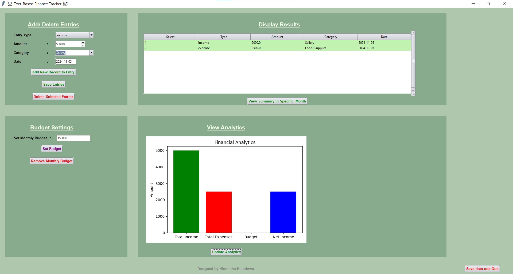

# 💸 Text Based Finance Tracker 💸


An aesthetic, green-themed expense tracker app built with **Python** and **Tkinter** to manage your income, expenses, and budgets, all with a smooth, easy-to-use graphical interface! 🌱



---

## 🌟 Key Features

- **Add Transactions** 💰: Log your income and expenses with ease.
- **Delete Transactions** 🗑️: Remove unwanted entries at any time.
- **View Summary** 📊: Visualize your financial data with clear summaries and charts.
- **Set Budget** 🎯: Monitor your monthly budget and receive reminders when nearing limits.

---

## 📋 Requirements

This app uses several libraries to provide a comprehensive expense-tracking experience:

- **tkinter**: For GUI components
- **ttkthemes**: For applying custom themes
- **tkcalendar**: For date-picking functionality
- **matplotlib**: For displaying charts and summaries
- **json**: To store and retrieve data
- **os**: For handling file paths

To install the necessary libraries, run the following command:
```bash
pip install tkinter ttkthemes tkcalendar matplotlib
